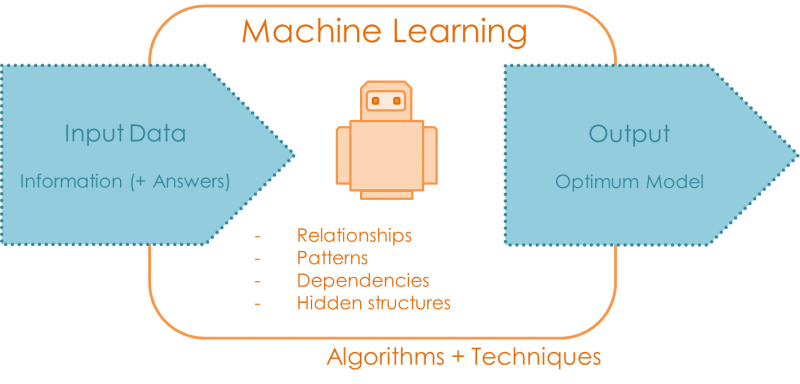
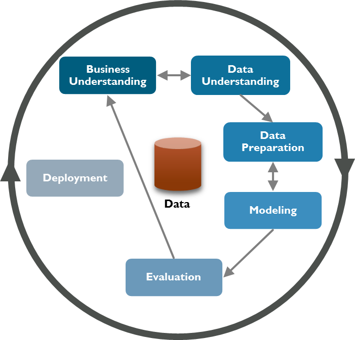

# Week 1: Introduction to Machine Learning

  
Table of Contents

  <ol>
    <li><a href="#introduction-to-machine-learning">Introduction to Machine Learning</a></li>
    <li><a href="#machine-learning-vs-rule-based-systems">Machine Learning vs Rule-based Systems</a></li>
    <li><a href="#supervised-machine-learning">Supervised Machine Learning</a></li>
    <li><a href="#crisp-dm">CRISP-DM</a></li>
    <li><a href="#model-selection">Model Selection</a></li>
  </ol>

## Introduction to Machine Learning

**Machine Learning** is a technique used to build models which extract
patterns from data.

* **Features** are characteristics of the data that we've got.
* The **Target** variable is the feature of a dataset that we want
  to understand in a deeper way.
* A **model** is a set of statistical / rule-based patterns that predict a
  target given some features.

## Machine Learning vs Rule-based Systems

Rule-based Systems stem from the first artificial intelligence concepts, and are
closely related with Expert Systems.
In Rule-based Systems, the developer (which usually has a deep understanding of the domain) uses
rules to make deductions. This can easily be achieved via `if-else` conditions.

Nonetheless, this is an extremely impractical approach to extract complex patterns from data.
For this reason, Machine Learning has evolved to use statistical algorithms (or well, statistical learning) to do
such a task.
Some of those algorithms are: Linear Regression, Logistic Regression, K-means, Naive Bayes, K-Nearest Neighbors, etc.

It's important to note that Machine learning systems can learn from past data and adapt to new situations by themselves,
whereas rule-based systems require human intervention for any changes.

## Supervised Machine Learning

*Supervised Machine Learning* is defined as a subset of Machine Learning.
Its main trait is that **for evey record there must be a target variable**.

Some of the most common problems in Supervised Machine Learning are:

* Regression: Predicting a numerical target variable
* Classification: Predicting a categorical target variable
* Ranking: Predicting the relevance score of an item

On the other hand, **Unsupervised Machine Learning** is the opposite, there's no target variable.
Some common problems in Unsupervised Machine Learning are Clustering & Anomaly detection.

Most common problems in the machine learning field of study are usually in the Supervised category.

## CRISP-DM

CRISP-DM provides a standardized description of the life cycle of a standard data analysis project,
analogous to software engineering software development life cycle models, which can be evidenced below:

1. **Business Understanding:** understand the extent of the problem, determine measurable goals and assess whether
   Machine Learning is an appropriate solution.
2. **Data Understanding:** Collect the data, identify quality problems and discover preliminary knowledge.
3. **Data Preparation:** Data Cleaning and Feature Extraction.
4. **Modeling:** Train & Test different Machine Learning models in order to determine the best one
5. **Evaluation:** Evaluate if the selected model satisfies the business objectives.
6. **Deployment:**: Roll the model to production.

As CRISP-DM is an iterative process, iterations might be done continuously in order to
perfect the model and met the stakeholder needs.

For a more in-depth take at the CRISP-DM, you can take a look at my
[Medium Article](https://medium.com/@jxareas/the-crisp-dm-methodology-for-data-science-f7201427e090).

## Model Selection

The model selection process consists of the following steps:

1. Split the original dataset, into the following sets:
    - Train (60%)
    - Validation (20%)
    - Set (20%)
2. Train several models using the training data
3. Evaluate the models with the validation set and select the best-performant model
4. Test the model with the test data
5. Assess whether results with the test data are good enough.

Moreover, we can combine the train set with the validation set with the purpose of creating
a bigger training set, so as to give the model a better change to learn patterns from the given
data. With this new approach, we expect the model to have a considerable improvement with the
test data.

